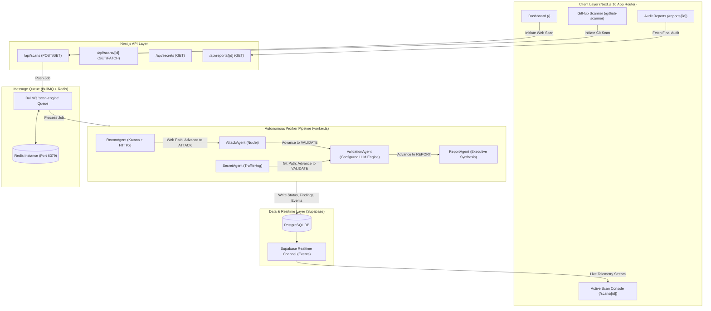
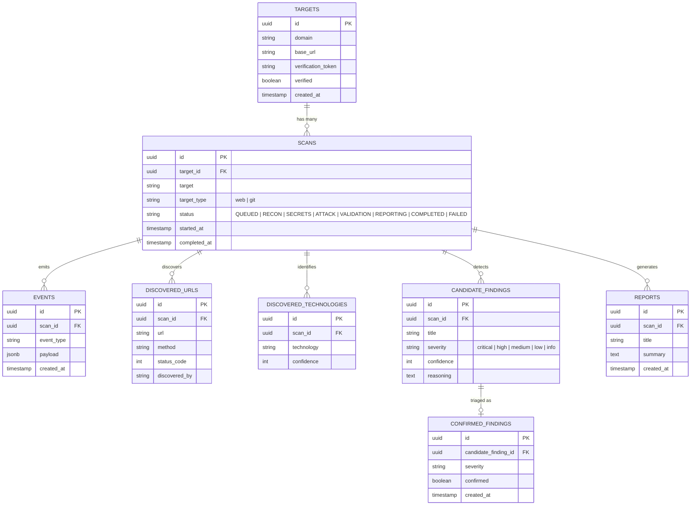

# Sentinel — Master Technical Architecture & System Specification

> **Version:** 2.0 (Production Blueprint)  
> **Classification:** Comprehensive Technical Documentation  
> **System Scope:** Autonomous AI-Assisted Authorized Penetration Testing & Secret Scanner Platform  

---

## Table of Contents
1. [Executive Summary & Core Philosophy](#1-executive-summary--core-philosophy)
2. [High-Level System Architecture](#2-high-level-system-architecture)
3. [Technology Stack & Infrastructure](#3-technology-stack--infrastructure)
4. [Database & Data Model Specification](#4-database--data-model-specification)
5. [Autonomous Agent Architecture & State Machine](#5-autonomous-agent-architecture--state-machine)
6. [Security Tool Wrappers & Process Execution](#6-security-tool-wrappers--process-execution)
7. [AI Validation & LLM Triage Engine](#7-ai-validation--llm-triage-engine)
8. [Asynchronous Worker & Queue Architecture](#8-asynchronous-worker--queue-architecture)
9. [Frontend Architecture & Vercel Design System](#9-frontend-architecture--vercel-design-system)
10. [API Route Specifications & Telemetry Contracts](#10-api-route-specifications--telemetry-contracts)
11. [Security Hardening, IDOR Protection & Reliability](#11-security-hardening-idor-protection--reliability)
12. [Environment Configuration & Deployment Guide](#12-environment-configuration--deployment-guide)

---

## 1. Executive Summary & Core Philosophy

**Sentinel** is an autonomous, agentic offensive security and automated remediation platform designed to allow a single security engineer to perform full-spectrum application security assessments and code patching at scale. 

The platform operates on two unified foundational pillars:
1. **Dynamic Web Surface Penetration Testing:** Automated crawling (Katana), HTTP technology fingerprinting (HTTPx), deterministic vulnerability exploitation (Nuclei), and LLM-driven false-positive elimination.
2. **GitHub Repository Scanner & Autonomous Code Fixer (Auto-Patcher):** Deep Git repository auditing (TruffleHog & AST code scan), live cryptographic token verification against cloud APIs, and automated AI-assisted patch generation (producing verified `git diff` fixes and automated GitHub Pull Requests).

### Core Architectural Principles
* **Evidence Before Claims:** An alert cannot exist in Sentinel without reproducible, attached technical evidence (HTTP request/response pairs, commit hashes, or active cryptographic token verification statuses).
* **Deterministic Tools Discover, AI Triages & Fixes:** Deterministic, industry-standard CLI engines (`Katana`, `HTTPx`, `Nuclei`, `TruffleHog`) execute discovery; LLMs perform semantic reasoning, noise filtering, patch synthesis, and executive risk generation.
* **Closed-Loop Remediation:** Moving beyond passive scanning by generating production-ready code diffs to fix vulnerabilities at the source and dispatching automated GitHub Pull Requests.
* **Non-Blocking Reactive Telemetry:** Every agent action emits granular event logs into Supabase PostgreSQL, streaming live to the frontend via WebSockets/Supabase Realtime.

---

## 2. High-Level System Architecture

Sentinel follows an event-driven, decoupled client-worker architecture:



---

## 3. Technology Stack & Infrastructure

| Layer / Subsystem | Technology & Libraries | Purpose & Architectural Role |
| :--- | :--- | :--- |
| **Framework & App Shell** | Next.js 16.2.9 (Turbopack), React 19 | App Router, Server Actions, API Route handlers, React Server Components. |
| **Frontend & Diff UI** | Tailwind CSS v4, Monaco Diff (`@monaco-editor/react`) | Vercel monochromatic design tokens, 1px border rings, Monaco interactive code diff viewer. |
| **Theme Engine** | `next-themes` | Zero-FOUC theme switching (`light`, `dark`, `system`) with localStorage persistence. |
| **Database & Persistence** | Supabase (PostgreSQL 15+) | Relational persistence, JSONB event telemetry, findings, and patch storage with RLS. |
| **Realtime Engine** | Supabase Realtime (WebSockets) | Sub-second event broadcasting from background workers directly to browser terminals. |
| **Task Queue & Message Broker** | BullMQ 5.x + Redis 7+ (`ioredis`) | Distributed FIFO job queuing, pipeline state transitions, retries, and failure handlers. |
| **Web Reconnaissance** | ProjectDiscovery `Katana` & `HTTPx` | Depth-3 headless web crawling, endpoint spidering, and technology stack fingerprinting. |
| **Vulnerability Scanner** | ProjectDiscovery `Nuclei` v3 | Template-driven deterministic vulnerability exploitation and CVE matching. |
| **Repo & Secret Detection** | `TruffleHog` v3 + Git AST Parser | High-entropy regex and verified live API token exposure analysis in Git trees. |
| **Autonomous Code Fixer** | Tree-sitter AST, Unified Diff (`parse-diff`, `diff`), LLM Engine | Syntax tree analysis, vulnerability context extraction, and framework-specific `git diff` patch generation. |
| **GitHub PR & Git Automation** | `@octokit/rest`, `@octokit/auth-app`, `simple-git` | Automated GitHub branch creation (`sentinel-patch-xxx`), commit generation, and Pull Request dispatch. |
| **Sandbox & Test Runner** | Isolated Docker / Node VM sandbox, `Jest` / `PyTest` | Automated regression test execution on generated code patches before PR creation. |
| **AI Reasoning & Triage** | OpenAI-Compatible LLM Client | Zero-shot structured triage, false positive elimination, and executive risk summarization. |

---

## 4. Database & Data Model Specification

The database is built on Supabase PostgreSQL with relational integrity and cascading foreign keys.



### Table Definitions
1. **`targets`**: Stores unique root assets (e.g. `example.com` or `https://github.com/org/repo`).
2. **`scans`**: Tracks lifecycle state, scan parameters, target type, timestamps, and operator IDs.
3. **`events`**: Append-only telemetry log table powering the Live Terminal in the Scan Console.
4. **`discovered_urls`**: Endpoints crawled by Katana and verified live by HTTPx.
5. **`discovered_technologies`**: Web frameworks, CDNs, servers, and programming languages identified.
6. **`candidate_findings`**: Raw findings emitted by Nuclei or TruffleHog before AI triage.
7. **`confirmed_findings`**: Post-triage verification status (`confirmed = true` vs `confirmed = false` false positives).
8. **`reports`**: Published executive risk summaries and audit packages synthesized by ReportAgent.

---

## 5. Autonomous Agent Architecture & State Machine

Sentinel utilizes an autonomous multi-agent pipeline subclassed from `BaseAgent`:

```
               ┌───────────────┐
               │  QUEUED Scan  │
               └───────┬───────┘
                       │
          ┌────────────┴────────────┐
          ▼ (target_type == 'web')  ▼ (target_type == 'git')
   ┌──────────────┐          ┌──────────────┐
   │  ReconAgent  │          │ SecretAgent  │
   └──────┬───────┘          └──────┬───────┘
          │ (Katana + HTTPx)        │ (TruffleHog)
          ▼                         │
   ┌──────────────┐                 │
   │ AttackAgent  │                 │
   └──────┬───────┘                 │
          │ (Nuclei)                │
          └────────────┬────────────┘
                       ▼
            ┌─────────────────────┐
            │   ValidationAgent   │  (LLM Triage & FP Elimination)
            └──────────┬──────────┘
                       ▼
            ┌─────────────────────┐
            │     ReportAgent     │  (Executive Synthesis & Publish)
            └──────────┬──────────┘
                       ▼
            ┌─────────────────────┐
            │  COMPLETED / READY  │
            └─────────────────────┘
```

### 1. `BaseAgent` (`src/lib/agents/base.ts`)
* **Role**: Foundation class providing database access (`supabaseAdmin`), scan context (`AgentContext`), and structured event logging.
* **Telemetry Method**: `logEvent(eventType: string, payload: any)` inserts rows directly into the `events` table with automatic timestamping.

### 2. `ReconAgent` (`src/lib/agents/recon.ts`)
* **Execution Flow**:
  1. Updates scan status to `RECON`.
  2. Spawns `runKatana` to crawl the target domain and collect distinct endpoints in a `Set<string>`.
  3. Spawns `runHttpx` over discovered URLs to probe status codes and fingerprint web technologies.
  4. Batch-inserts discovered URLs into `discovered_urls` and technologies into `discovered_technologies`.
  5. Returns `{ success: true, nextStep: 'ATTACK' }`.

### 3. `AttackAgent` (`src/lib/agents/attack.ts`)
* **Execution Flow**:
  1. Queries `discovered_urls` from Supabase for the given `scanId`.
  2. Spawns `runNuclei` with standard severity-tagged vulnerability templates.
  3. Captures structured stdout JSON lines, formatting technical evidence (matched URL, template ID, description, extracted data).
  4. Inserts results into `candidate_findings`.
  5. Returns `{ success: true, nextStep: 'VALIDATE' }`.

### 4. `SecretAgent` (`src/lib/agents/secret.ts`)
* **Execution Flow**:
  1. Normalizes GitHub/Git URLs (supporting `https://` and `git@` SSH formats).
  2. Spawns `runTruffleHogGit` against the remote repository.
  3. Deduplicates detected keys using composite hash signatures (`detector:file:commit:snippet`).
  4. Tags verified live secrets as `CRITICAL` and unverified matches as `HIGH`.
  5. Inserts secrets into `candidate_findings` and returns `{ success: true, nextStep: 'VALIDATE' }`.

### 5. `ValidationAgent` (`src/lib/agents/validation.ts`)
* **Execution Flow**:
  1. Fetches all unvalidated `candidate_findings` for the scan.
  2. Submits each candidate finding to the configured LLM with zero-shot triage instructions and structured JSON response schemas.
  3. Classifies whether the finding is a genuine risk or an automated false positive.
  4. Records the verdict into `confirmed_findings` (`confirmed: true` or `false`).
  5. Returns `{ success: true, nextStep: 'REPORT' }`.

### 6. `ReportAgent` (`src/lib/agents/reporting.ts`)
* **Execution Flow**:
  1. Aggregates all scan metadata, fingerprinted technologies, and verified vulnerabilities.
  2. Prompts the configured LLM to synthesize an objective 2–3 paragraph Executive Risk Summary with remediation guidance.
  3. Inserts the published document into `reports`.
  4. Sets `scans.status = 'COMPLETED'` and records `completed_at`.

---

## 6. Security Tool Wrappers & Process Execution

All security engines run as isolated child processes via Node.js `child_process.spawn`.

### 1. Katana Wrapper (`src/lib/tools/katana.ts`)
* **Command Signature**: `katana -u <target> -d 3 -jc -silent -jsonl`
* **Features**: Headless crawling depth 3, automatic JavaScript parsing (`-jc`), non-blocking NDJSON line streaming.

### 2. HTTPx Wrapper (`src/lib/tools/httpx.ts`)
* **Command Signature**: `httpx -l <tempFile> -tech-detect -status-code -silent -json`
* **Concurrency Protection**: Generates temporary input files with collision-safe UUIDs (`httpx-${randomUUID()}.txt`).

### 3. Nuclei Wrapper (`src/lib/tools/nuclei.ts`)
* **Command Signature**: `nuclei -l <tempFile> -silent -jsonl -severity critical,high,medium,low`
* **Timeout & Safe Teardown**: Enforces a 5-minute timeout window with automatic process termination on hang.

### 4. TruffleHog Wrapper (`src/lib/tools/trufflehog.ts`)
* **Command Signature**: `trufflehog git <repoUrl> --json --only-verified=false`
* **Verification Engine**: Parses both live active API keys (`verified: true`) and heuristic pattern matches.

---

## 7. AI Validation & LLM Triage Engine

The triage engine bridges the gap between scanner noise and verified security findings.

### Triage Prompt Schema (`ValidationAgent`)
```typescript
const prompt = `
You are an expert cybersecurity triage agent.
Your job is to read a raw vulnerability finding from an automated scanner (Nuclei) and determine if it is a REAL vulnerability or a FALSE POSITIVE.

Finding Title: ${finding.title}
Severity: ${finding.severity}
Raw Output / Reasoning:
${finding.reasoning}

Analyze the URL, the vulnerability type, and the extracted data. 
For example, if the finding is "Default Login" but the URL is a public social media page like Instagram or Twitter, it is a FALSE POSITIVE.

Respond with ONLY a JSON object in this exact format:
{
  "is_false_positive": boolean,
  "reason": "1 sentence explanation"
}`;
```

### Executive Summary Synthesis Prompt (`ReportAgent`)
```typescript
const prompt = `
You are a senior penetration testing lead.
Write a concise 2-3 paragraph Executive Risk Summary for a security audit report.

Target: ${targetDomain}
Identified Technologies: ${techList}
Candidate Findings Evaluated: ${totalCandidates}
AI Verified Vulnerabilities: ${verifiedVulns.length}
False Positives Filtered Out: ${falsePositives.length}

Verified Findings Details:
${JSON.stringify(verifiedVulns, null, 2)}

Provide a professional, objective summary describing the security posture, key exposure risks, and top priority remediation steps. Do not include markdown headers or bullet points; output clean paragraphs.`;
```

---

## 8. Asynchronous Worker & Queue Architecture

### BullMQ State Machine (`worker.ts`)
The background worker listens on the `scan-engine` Redis queue:
1. **Atomic Job Dispatching**: Retrieves jobs containing `{ scanId, target, step }`.
2. **Dynamic Step Execution**: Instantiates the appropriate agent based on `step` (`recon`, `secrets`, `ATTACK`, `VALIDATE`, `REPORT`).
3. **Step Chaining**: When an agent finishes successfully, it enqueues the next step into `scanQueue.add(result.nextStep, { scanId, target, step: result.nextStep })`.
4. **Lock Management**: Configured with a `lockDuration: 300000` (5 minutes) to support long-running crawling and scanning jobs without worker eviction.

---

## 9. Frontend Architecture & Vercel Design System

The frontend is constructed using a high-density, minimal-radius design language inspired by Vercel:

```
┌────────────────────────────────────────────────────────────────────────┐
│  🛡️ Sentinel   Dashboard   GitHub Scanner (Secrets)   Reports   [ 🌓 ] │
├────────────────────────────────────────────────────────────────────────┤
│                                                                        │
│  [  Active Scans: 4  ]  [ Total Targets: 12 ]  [ Verified Vulns: 7 ]  │
│                                                                        │
│  ┌──────────────────────────────────────────────────────────────────┐  │
│  │ ⚡ Active Scans Live Telemetry                                   │  │
│  │ ---------------------------------------------------------------- │  │
│  │ example.com     • RECON       2m 14s    [ View Live Console → ]  │  │
│  │ github.com/api  • COMPLETED   4m 02s    [ View Audit Report → ]  │  │
│  └──────────────────────────────────────────────────────────────────┘  │
└────────────────────────────────────────────────────────────────────────┘
```

### UI Pages
1. **`/` (Security Dashboard)**: High-level risk metrics, recent target status, active scan launcher modal.
2. **`/github-scanner` (GitHub Secret Scanner)**: Dedicated repository key auditor, live detector filters, commit provenance inspection.
3. **`/scans/[scanId]` (Active Scan Console)**: Real-time telemetry, visual stepper, live streaming terminal, discovered URL/tech tabs, and scan cancellation modal.
4. **`/reports` & `/reports/[scanId]` (Assessment Reports)**: Catalog of finalized audit reports, AI noise reduction metrics, technical evidence previews, JSON export, and print-ready PDF export.
5. **`/login` & `/auth/update-password` (Authentication Portal)**: Google OAuth and email/password authentication forms.

### Theme Tokens (`src/app/globals.css`)
* **Light Palette**: `--background: #ffffff`, `--foreground: #171717`, `--border: #ebebeb`, `--card: #ffffff`.
* **Dark Palette (`.dark`)**: `--background: #000000`, `--foreground: #ededed`, `--border: #262626`, `--card: #0a0a0a`, `--secondary: #171717`.

---

## 10. API Route Specifications & Telemetry Contracts

### 1. `POST /api/scans`
* **Description**: Initiates a new web or Git security assessment.
* **Request Body**:
  ```json
  {
    "target": "example.com",
    "targetType": "web"
  }
  ```
* **Response (200 OK)**:
  ```json
  {
    "success": true,
    "scanId": "a6f78a1a-48a4-45fa-abe8-2e8d392413ad",
    "status": "QUEUED"
  }
  ```

### 2. `GET /api/scans/[scanId]`
* **Description**: Fetches complete scan metadata, events log history, discovered URLs, technologies, and candidate findings.
* **Response (200 OK)**:
  ```json
  {
    "scan": { "id": "uuid", "target": "example.com", "status": "ATTACK", "started_at": "..." },
    "events": [{ "id": "uuid", "event_type": "NUCLEI_RUNNING", "payload": {}, "created_at": "..." }],
    "discovered_urls": [{ "url": "https://example.com/api", "status_code": 200 }],
    "discovered_technologies": [{ "technology": "Next.js", "confidence": 100 }],
    "candidate_findings": [{ "title": "CVE-2023-XXXX", "severity": "critical" }]
  }
  ```

### 3. `PATCH /api/scans/[scanId]`
* **Description**: Cancels an active scan, setting its status to `FAILED` and logging a `SCAN_CANCELLED_BY_USER` event.

### 4. `GET /api/secrets`
* **Description**: Returns aggregated metrics for Git repository scans, detector breakdowns, and active secret inventories.

### 5. `GET /api/reports/[scanId]`
* **Description**: Returns full synthesized audit data or streams a formatted JSON download when `?download=json` is provided.

---

## 11. Security Hardening, IDOR Protection & Reliability

* **Crash Prevention in Relational Queries**: Implemented defensive guards around PostgREST `.in('candidate_finding_id', candidateIds)` to prevent HTTP 400 crashes when `candidateIds` is empty.
* **Race-Condition-Free Temp Files**: Replaced millisecond timestamps (`Date.now()`) with `randomUUID()` in all tool wrappers (`httpx.ts`, `nuclei.ts`).
* **Strict Type Safety**: Eliminated `any[]` state arrays across frontend pages, enforcing strict interfaces (`Scan`, `CandidateFinding`, `ConfirmedFinding`, `DiscoveredUrl`).
* **Debounced Realtime Refreshes**: Realtime WebSocket subscriptions on the dashboard are debounced by 500ms to eliminate UI thrashing during rapid batch inserts.
* **Thought Block Stripping**: Regular expressions automatically strip `<thought>` reasoning blocks returned by reasoning LLMs to ensure clean user-facing reports.

---

## 12. Environment Configuration & Deployment Guide

### Required Environment Variables (`.env.local`)
```env
# Supabase Configuration
NEXT_PUBLIC_SUPABASE_URL=https://your-project.supabase.co
NEXT_PUBLIC_SUPABASE_ANON_KEY=eyJhbGciOi...
SUPABASE_SERVICE_ROLE_KEY=eyJhbGciOi...

# AI / LLM Provider Configuration (OpenAI, Groq, Together, Ollama, Local Engine)
OPENAI_API_KEY=your_api_key_here
OPENAI_BASE_URL=https://api.openai.com/v1
LLM_MODEL=your-chosen-llm-model

# Message Queue Configuration
REDIS_URL=redis://localhost:6379
```

### Running Sentinel Locally
```bash
# 1. Start Redis Server
redis-server

# 2. Run the Background Worker
npm run worker

# 3. Start Next.js Development Server
npm run dev
```

The application will be accessible at `http://localhost:3000`.
